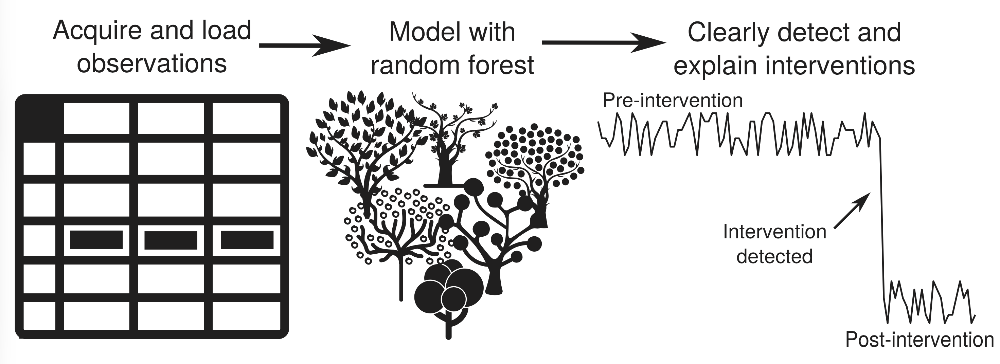

We have a long-standing interest in developing statistical and machine learning techniques to characterise the sources of air pollutants and to detect and quantify the effects of interventions aimed at improving air quality. Much of this work is closely linked with the [openair](../openair/) software, which makes many of these methods freely available to the wider research community.

---

## Source characterisation

A central thread of our analytical work has been the use of *bivariate polar plots* to investigate the directional and meteorological fingerprints of pollution sources. By combining wind speed, wind direction, and pollutant concentration data, these plots can identify source sectors, distinguish local from regional contributions, and track how source characteristics evolve over time.

Key developments include:

- Triangulating and estimating source contributions at a major international airport ([Carslaw et al., 2006](../../publications/carslaw-2006-a/))
- Clustering polar plot surfaces to identify groups of similar source behaviour ([Carslaw and Beevers, 2013](../../publications/carslaw-2013-a/))
- The conditional bivariate probability function for source attribution ([Carslaw and Uria-Tellaetxe, 2014](../../publications/carslaw-2014/))
- Extension to two-pollutant polar statistics to exploit chemical relationships between species ([Grange et al., 2016](../../publications/carslaw-2016-b/))

Alongside polar plot methods, we have used ambient NO~x~ and NO~2~ concentration data to estimate the directly emitted fraction of NO~2~ in vehicle exhaust — including the first identification that primary NO~2~ emissions from diesel vehicles were increasing ([Carslaw, 2005](../../publications/carslaw-2005-b/)), and later work showing the subsequent decrease ([Carslaw et al., 2016](../../publications/carslaw-2016-a/); [Grange et al., 2017](../../publications/grange-2017/)).

---

## Meteorological normalisation

Detecting real changes in air pollutant concentrations driven by emissions or policy is complicated by year-to-year variability in meteorology, which can easily dominate or obscure the underlying emission signal. We were among the first to apply machine learning in this area, using boosted regression trees to separate meteorological variability from emission trends in pollutant time series ([Carslaw and Taylor, 2009](../../publications/carslaw-2009/)).

We subsequently developed this into a general **meteorological normalisation** framework based on random forest models (Grange et al., 2018; [Grange and Carslaw, 2019](../../publications/grange-2019/)). The approach trains a model to predict concentrations as a function of meteorological variables, then resamples that model over a fixed, randomised meteorology to produce a concentration time series that reflects only changes in emissions. This makes it far easier to detect the true effect of traffic interventions, low emission zones, or other policy measures.

The method has since been widely adopted by the air quality community internationally. It underpinned some of the most rigorous assessments of air quality during the COVID-19 lockdowns — including the finding that reduced traffic emissions, while cutting NO~x~, risked increasing urban ozone concentrations across European cities ([Grange et al., 2021](../../publications/grange-2021a/)). The method is implemented in the [deweather](../openair/) R package.

::: {.grid}
::: {.g-col-12 .g-col-md-8}

:::
::: {.g-col-12 .g-col-md-4}

:::
:::

---

## Key publications

- [Grange et al. (2021)](../../publications/grange-2021a/) — COVID-19 lockdowns highlight a risk of increasing ozone pollution in European urban areas. *Atmospheric Chemistry and Physics*, 21, 4169–4185.

- [Grange and Carslaw (2019)](../../publications/grange-2019/) — Using meteorological normalisation to detect interventions in air quality time series. *Science of the Total Environment*, 653, 578–588.

- Grange, S. K., Carslaw, D. C., Lewis, A. C., Boleti, E. and Hueglin, C. (2018) — Random forest meteorological normalisation models for Swiss PM~10~ trend analysis. *Atmospheric Chemistry and Physics*, 18, 6223–6239.

- [Carslaw and Taylor (2009)](../../publications/carslaw-2009/) — Analysis of air pollution data at a mixed source location using boosted regression trees. *Atmospheric Environment*, 43, 3563–3570.
