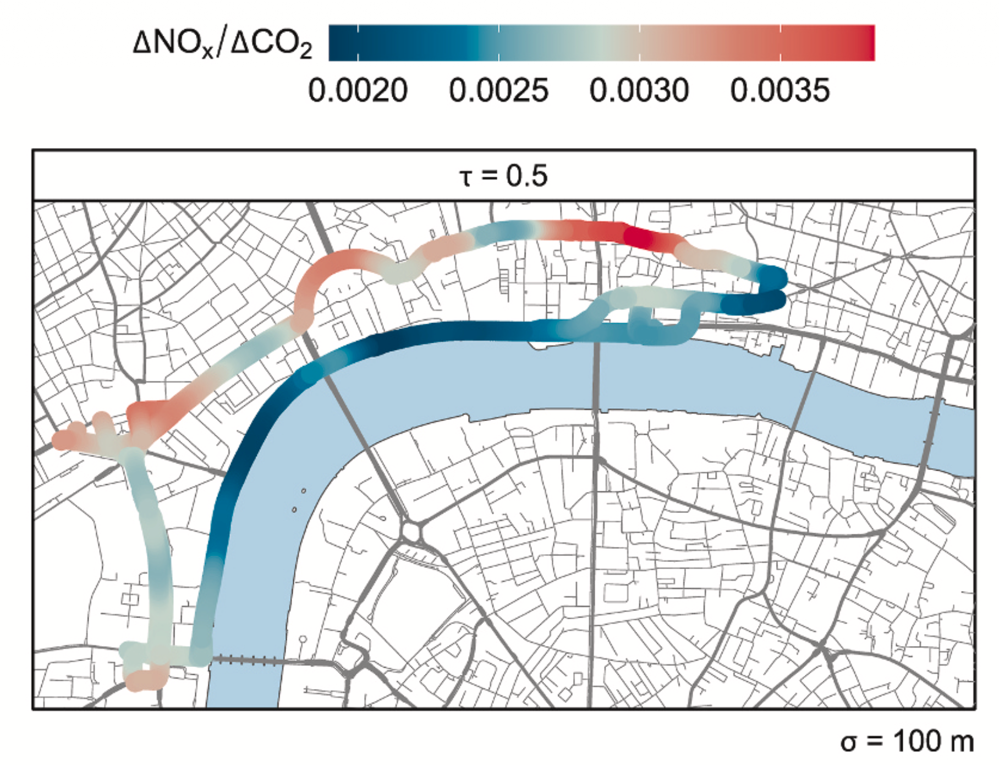
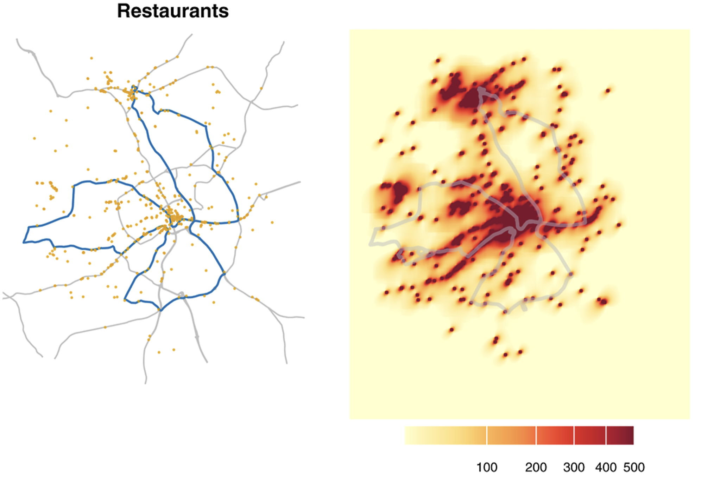

Mobile measurement platforms — vehicles or instruments capable of sampling while in motion — provide a uniquely powerful window onto the spatial variability of air pollutants and their sources. Where fixed monitoring stations give continuous but spatially sparse records, mobile campaigns can map emissions at the street scale, capture the heterogeneous urban environment, and isolate source contributions that would otherwise be confounded at a single fixed point.

Our mobile measurement work spans two complementary directions: **methodological development** of mobile platforms and fast-response instruments capable of detecting a wide range of species; and **applied campaigns** that use mobile monitoring to answer specific questions about urban emission sources and their impacts.

---

## Methodological developments

### A mobile laboratory for VOCs and trace gases

A key advance was the development and characterisation of a mobile laboratory incorporating a **selected-ion flow-tube mass spectrometer (SIFT-MS)** — an instrument capable of real-time, simultaneous detection of a broad range of volatile organic compounds (VOCs) and trace gases at parts-per-billion concentrations. [Wagner et al. (2021)](../../publications/wagner-2021a/) provided a systematic evaluation of this mobile platform, demonstrating that SIFT-MS measurements made in motion are comparable in quality to those from fixed installations. The work established protocols for instrument operation, data quality control, and the treatment of dilution and background variability during mobile sampling, laying the methodological foundation for subsequent urban campaigns.

::: {.grid}
::: {.g-col-12 .g-col-md-6}
::: {.callout-note appearance="minimal"}
**Figure 1** — The NO~x~/CO~2~ emission ratio from the aggregate of over 50 individual journeys.
:::
:::
::: {.g-col-12 .g-col-md-6}
::: {.callout-note appearance="minimal"}
**Figure 2** — Distribution of restaurants and associated source intensity map.
:::
:::
:::

---

## Research highlights

- **Congestion penalty for vehicle emissions** — [Wilde et al. (2024)](../../publications/wilde-2024a/) used repeated mobile monitoring passes across central London to show that traffic congestion imposes a systematic penalty on per-vehicle NO~x~ emissions, with vehicles in slow-moving or stop-start conditions emitting substantially more than at free-flow speeds. The work quantified this "congestion penalty" and highlighted its implications for emission inventories that use average-speed emission factors.

- **Non-vehicular particulate matter in London** — [Wilson et al. (2024)](../../publications/wilson-2024a/) showed that mobile monitoring across London streets revealed non-vehicular sources — including brake and tyre wear, and re-suspended road dust — to be important contributors to near-road particle concentrations, even on busy arterial routes where tailpipe exhaust might be expected to dominate. The spatial resolution of the mobile approach was essential for detecting these contributions.

- **Linking indoor commercial emissions to outdoor VOCs** — [Budisulistiorini et al. (2026)](../../publications/budisulistiorini-2026/) extended the mobile measurement framework to commercial indoor emission sources, demonstrating how VOC signatures from restaurants, dry cleaners, and other commercial premises can be detected in the outdoor urban environment. This work opens a new measurement pathway for inventorying and attributing non-traffic VOC sources that are underrepresented in conventional monitoring networks.

---

## Key publications

- [Wagner et al. (2021)](../../publications/wagner-2021a/) — Application of a mobile laboratory using a selected-ion flow-tube mass spectrometer (SIFT-MS) for characterisation of volatile organic compounds and atmospheric trace gases. *Atmospheric Measurement Techniques*, 14, 6083–6100.

- [Wilde et al. (2024)](../../publications/wilde-2024a/) — Mobile monitoring reveals congestion penalty for vehicle emissions in London. *Atmospheric Environment: X*, 21, 100241.

- [Wilson et al. (2024)](../../publications/wilson-2024a/) — Mobile monitoring reveals the importance of non-vehicular particulate matter sources in London. *Environmental Science: Processes & Impacts*.

- [Budisulistiorini et al. (2026)](../../publications/budisulistiorini-2026/) — Toward linking indoor commercial source emissions to outdoor volatile organic compounds using mobile measurements. *Environmental Science & Technology Air*.
