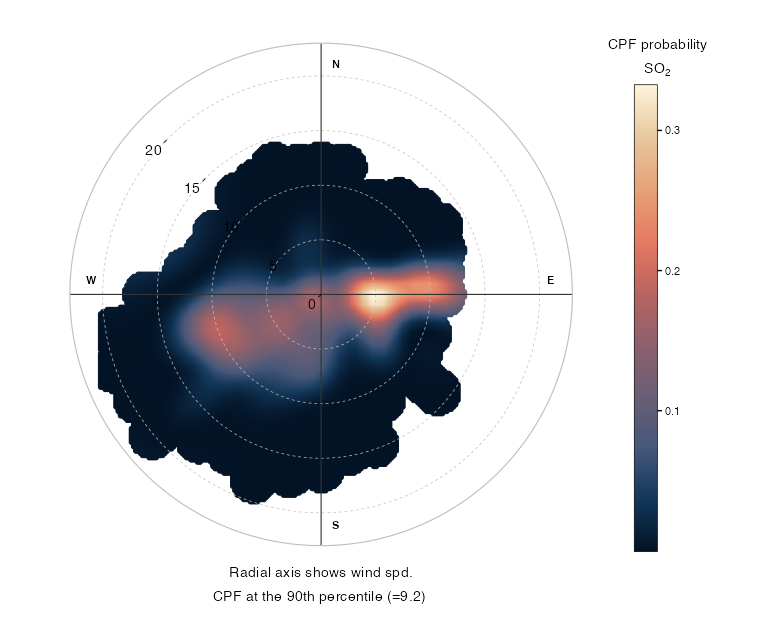
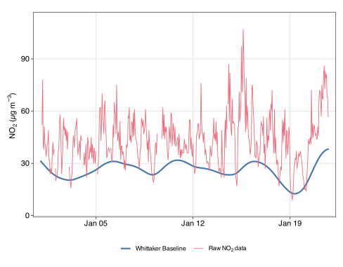

Many of the receptor modelling and time series approaches we develop are made available through open-source software called **openair**. The project began as a knowledge exchange initiative funded by the Natural Environment Research Council (NERC), with subsequent support from the Department for Environment, Food & Rural Affairs (Defra). Its aim is to put innovative, well-documented analysis techniques for air pollution and wider atmospheric composition data into the hands of as many researchers as possible. openair is written in the R programming language and is openly and freely available to anyone.

Since the original [2012 publication](../../publications/carslaw-2012-b/), openair has grown from a single package into a coordinated family of complementary tools, developed and maintained by David Carslaw together with [Jack Davison](https://www.jackdavison.co.uk/). Together these give researchers a reproducible, end-to-end workflow — from importing data through to source characterisation, trend detection, and the robust quantification of intervention effects.

The package is used extensively throughout the world across academia and the public and private sectors. The original software paper has been cited **well over 2,000 times**, and the core package alone has been downloaded more than **650,000 times** from CRAN, making it one of the most widely used tools in air quality science. Comprehensive documentation, worked examples, and guidance are maintained in the freely available [openair book](https://openair-project.github.io/openair/).

---

## The package family

The openair project ([github.com/openair-project](https://github.com/openair-project)) currently comprises four main packages:

::: {.grid}

::: {.g-col-12 .g-col-md-6}
### `openair`

The core package provides trend and time series analysis, directional analysis tools including bivariate polar plots and conditional probability functions, temporal component extraction,wind and pollution roses, calendar plots, back-trajectory analysis, and model evaluation methods. It includes direct import of data from several hundred UK air quality monitoring sites and international networks.

[GitHub](https://github.com/openair-project/openair){.btn .btn-sm .btn-outline-primary target="_blank"}
[Documentation](https://openair-project.github.io/openair/){.btn .btn-sm .btn-outline-secondary target="_blank"}
:::

::: {.g-col-12 .g-col-md-6}
### `openairmaps`

Provides interactive and publication-quality mapping of air quality data, including network maps, directional analysis maps (polar plots on a map background), and trajectory frequency maps. Built on `{leaflet}` and `{ggplot2}`, it makes it straightforward to place openair-style analyses in geographic context.

[GitHub](https://github.com/openair-project/openairmaps){.btn .btn-sm .btn-outline-primary target="_blank"}
[Documentation](https://openair-project.github.io/openairmaps/){.btn .btn-sm .btn-outline-secondary target="_blank"}
:::

::: {.g-col-12 .g-col-md-6}
### `worldmet`

Provides ready access to global surface meteorological observations from the NOAA Global Historical Climatology Network (GHCN) — tens of thousands of sites worldwide. Meteorological data (wind speed and direction, temperature, humidity, and more) are essential for most openair analyses, and worldmet makes importing them straightforward for any location and time period.

[GitHub](https://github.com/openair-project/worldmet){.btn .btn-sm .btn-outline-primary target="_blank"}
[Documentation](https://openair-project.github.io/worldmet/){.btn .btn-sm .btn-outline-secondary target="_blank"}
:::

::: {.g-col-12 .g-col-md-6}
### `deweather`

Implements machine-learning-based meteorological normalisation to remove the influence of weather variability from atmospheric composition time series. This allows underlying emission trends and the effect of policy interventions to be isolated from the noise introduced by year-to-year meteorological variation.

[GitHub](https://github.com/openair-project/deweather){.btn .btn-sm .btn-outline-primary target="_blank"}
[Documentation](https://openair-project.github.io/deweather/){.btn .btn-sm .btn-outline-secondary target="_blank"}
:::

:::

---

## Examples

::: {.grid}
::: {.g-col-12 .g-col-md-6}

:::

::: {.g-col-12 .g-col-md-6}

:::
:::

---

## Resources

- [openair book](https://openair-project.github.io/openair/) — comprehensive online documentation and worked examples
- [openair-project on GitHub](https://github.com/openair-project) — source code for all packages
- [Carslaw & Ropkins (2012)](../../publications/carslaw-2012-b/) — the original openair software paper
