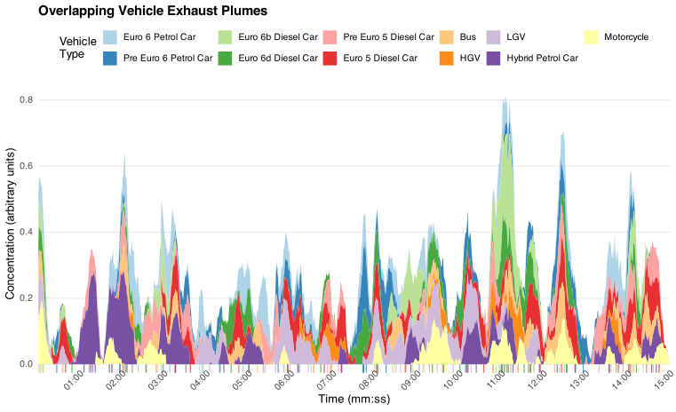

Our vehicle emissions research is focused on understanding the real-world emissions performance of vehicles using a wide range of measurement approaches — including crossroad remote sensing, fast-response continuous point sampling close to roads, and mobile measurements. The overarching aim is to produce robust, measurement-based evidence that can inform emission inventories, air quality policy, and vehicle regulation.

More recently, we have developed a new technique called **plume regression** ([Farren et al., 2024](../../publications/farren-2024a/)), which uses fast-response instruments at the roadside to quantify vehicle emissions and provide direct concentration source apportionment. The technique overcomes a fundamental complexity of roadside measurements by deconvoluting the overlapping contributions of dispersing vehicle plumes, opening up new possibilities for high-throughput emission characterisation without the need for crossroad beam geometry.

---

## Research highlights

- **Tailpipe position and near-road air quality** — [Wilson et al. (2025)](../../publications/wilson-2025a/) quantified how vehicle design, and in particular exhaust tailpipe location, affects near-road concentrations of traffic-related air pollutants. The work received coverage in [The Guardian](https://www.theguardian.com).

- **Road vehicle ammonia** — [Farren et al. (2020)](../../publications/farren-2020a/) used complementary top-down and bottom-up methods to quantify UK total road vehicle NH~3~ emissions, demonstrating that the national inventory substantially under-estimates emissions from this source.

- **The European NO~2~ problem** — [Carslaw et al. (2011)](../../publications/carslaw-2011-a/) used extensive remote sensing measurements to show that NO~x~ emissions from light-duty diesel vehicles were not decreasing as expected. Combined with rising primary NO~2~ emissions ([Carslaw, 2005](../../publications/carslaw-2005-b/)), these two effects produced widespread roadside exceedances of the NO~2~ limit value across Europe.

- **Temperature dependence of diesel NO~x~** — [Grange et al. (2019)](../../publications/temperature-2019/) demonstrated a strong ambient temperature dependence in light-duty diesel NO~x~ emissions across measurement campaigns in 2017–2018, with important implications for emission inventories that assume constant emission factors regardless of temperature.

- **First UK measurements of direct NO~2~** — [Carslaw and Rhys-Tyler (2013)](../../publications/carslaw-2013-c/) made the first remote sensing measurements of direct NO~2~ emissions in London, revealing large variability in aftertreatment performance across the vehicle fleet.

---

## Measurement approaches

::: {.grid}

::: {.g-col-12 .g-col-md-6}
### Remote sensing

Crossroad remote sensing measures the emission ratios of individual vehicles as they pass through an infrared or ultraviolet beam. We have used instruments capable of simultaneously measuring NO~x~, NO~2~, NH~3~, hydrocarbons, and CO~2~, enabling fleet-scale characterisation across hundreds of thousands of vehicles.
:::

::: {.g-col-12 .g-col-md-6}
### Plume regression

Our plume regression technique ([Farren et al., 2024](../../publications/farren-2024a/)) uses roadside fast-response instruments combined with statistical deconvolution to attribute measured concentration enhancements to individual vehicles. It provides both emission quantification and direct source apportionment without requiring crossroad beam geometry.
:::

:::

::: {.callout-note appearance="minimal"}

:::

---

## Collaborations --- current and past

- **WSP** — extensive collaborative measurement campaigns using the Opus RSD5000 instrument, point sampling and plume chase.

- **The University of Denver** — where vehicle emission remote sensing was pioneered by the late Professor Donald Stedman and Dr Gary Bishop.

- **OPUS RSE** — based in Madrid, developers of the RSD5000. The University of York owns an RSD5000 instrument.

- **The CONOX partnership** — which led to the creation of Europe's first vehicle emission remote sensing database.
